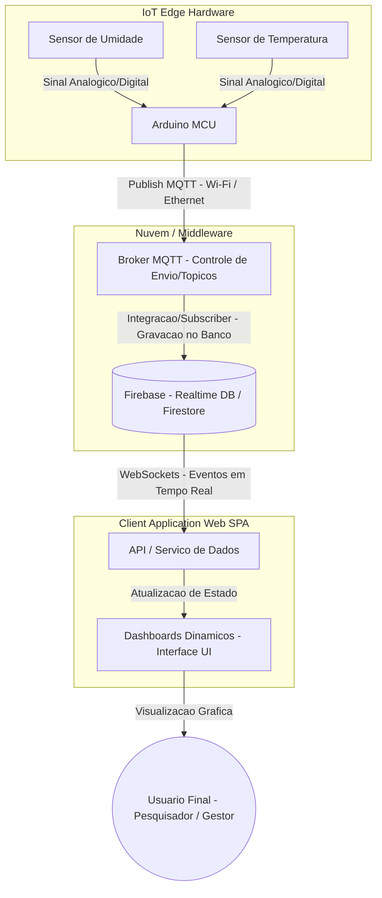
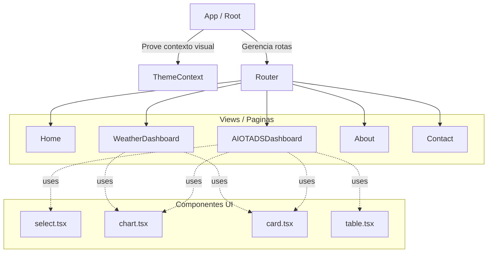

# Portal Data Insights - Liga Acadêmica de Engenharia de Software (LES)

## Sobre o Projeto

O **Data Insights** é uma plataforma web open-source desenvolvida com o objetivo de coletar, integrar e visualizar dados de projetos acadêmicos e de pesquisa de forma centralizada e acessível. Utilizando bases de dados heterogêneas simultaneamente, o sistema transforma dados brutos em insights claros e dashboards interativos e dinâmicos.

Desenvolvida com uma arquitetura orientada a eventos e a componentes, a plataforma processa e disponibiliza atualizações contínuas dos dados captados. É uma ferramenta responsiva, acessível a pesquisadores, gestores e a população em geral, dispensando qualquer necessidade de instalação.

---

## Objetivos

* Centralizar a visualização de dados de projetos e pesquisas do meio acadêmico.
* Integrar sensores físicos (IoT) a interfaces web em tempo real.
* Transformar dados brutos e complexos em painéis gerenciais e estatísticos fáceis de interpretar.
* Prover autonomia aos usuários através de exploração de dados com filtros de período e múltiplos tipos de gráficos.
* Promover a democratização da informação científica e acadêmica.

---

## Funcionalidades do Portal

* Visualização de dados meteorológicos em tempo real (WeatherDashboard).
* Monitoramento de movimentação, ociosidade e fluxo de pessoas em ambientes físicos (AIOTADSDashboard).
* Geração de gráficos interativos (linha, barra, área e distribuição).
* Extração automática de insights e tendências a partir do volume de dados analisados.
* Interface completamente responsiva e com suporte nativo a temas claro e escuro.

---

## Tecnologias Utilizadas

* **Vue.js** – Framework progressivo utilizado para a construção da interface de usuário em formato SPA (Single Page Application).
* **Firebase** – Realtime Database e Firestore utilizados para persistência de dados e sincronização via WebSockets.
* **Chart.js** – Biblioteca de renderização para os gráficos interativos dos dashboards.
* **CSS3 e Glassmorphism** – Estilização moderna baseada em variáveis e filtros translúcidos adaptáveis.
* **MQTT & Arduino** – Protocolos e hardwares responsáveis pela captação física no ambiente (IoT Edge).

---

## Estrutura do Projeto

A organização de pastas do projeto segue a arquitetura de componentização rigorosa para separar a camada de visualização das regras de negócio.

```text
projeto/
├── src/
│   ├── assets/       # Imagens locais, ícones e fontes
│   ├── components/   # Guarda os fragmentos de interface
│   │   ├── ui/       # Componentes genéricos e reutilizáveis
│   │   └── widgets/  # Componentes específicos que possuem regras de negócio
│   ├── layouts/      # Esqueleto da interface, representando páginas inteiras associadas a rotas
│   ├── data/         # Responsável pela camada de comunicação externa da aplicação
│   ├── style/        # CSS global e folhas de estilo padronizadas
│   ├── router/       # Centraliza as configurações do Vue Router e o mapeamento das URLs
│   ├── App.vue       # Componente principal / Ponto de Entrada
│   └── main.js       # Instância central do Vue
├── index.html        # Estrutura base da aplicação Web
├── .gitignore        # Arquivo de configuração do controle de versão
└── README.md         # Página de rosto e manual de instruções
```
## Arquitetura e Fluxo de Dados

A plataforma divide-se em um fluxo contínuo desde a captação do dado no ambiente físico até a renderização na tela do usuário.

### Fluxo de Comunicação (Hardware para Software)


### Arquitetura da Interface (Vue SPA)


## Responsividade

O portal foi projetado de forma fluida, adaptando-se sem perda de legibilidade ou quebra de gráficos aos seguintes dispositivos:

* Mobile
* Tablets
* Notebooks
* Desktops

## Sobre a Liga

A Liga Acadêmica de Engenharia de Software (LES) do IFPE Recife tem como missão integrar a teoria acadêmica e a prática de mercado. A organização promove o desenvolvimento de soluções tecnológicas robustas e escaláveis, incentivando a participação ativa dos estudantes em projetos, pesquisas científicas e eventos que gerem impacto real para a comunidade institucional e social.

## Equipe de Desenvolvimento

* **Ilian Solano Bezerra da Silva 1**
  *Idealizador, Presidente da LES e Criador do protótipo inicial*

* **Yuri Santos de Oliveira**
  *Idealizador, Vice-presidente da LES e Criador do protótipo inicial*

* **Victor Soares Couto da Silva**
  *Líder do Projeto e Desenvolvedor*

* **Márcio Luan Ferreira Barros**
  *Desenvolvedor*

* **Ian Elton Pereira da Silva**
  *Desenvolvedor*

## Contato

* Site Oficial da LES: https://lesifpe.com.br/
* Instagram: https://www.instagram.com/les.ifpe/
* Email: [lesifpe@gmail.com](mailto:lesifpe@gmail.com)

## Licença

Este projeto possui caráter estritamente acadêmico, open-source e educacional, focado em melhorias estruturais para a comunidade do IFPE.